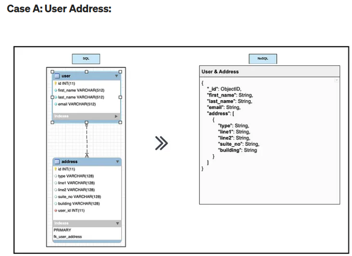
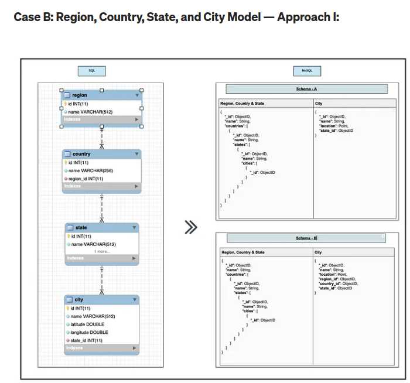
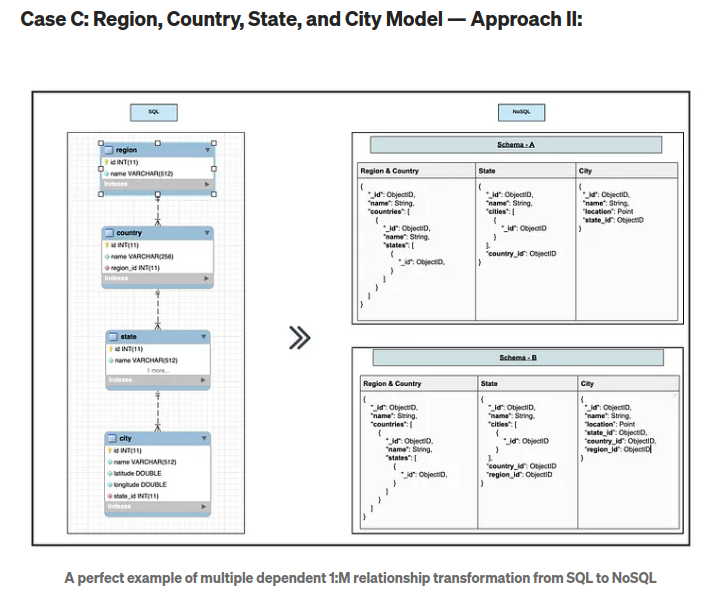
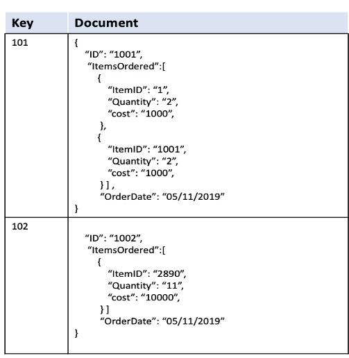
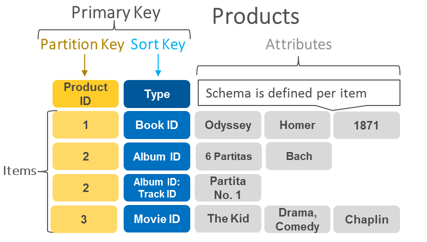
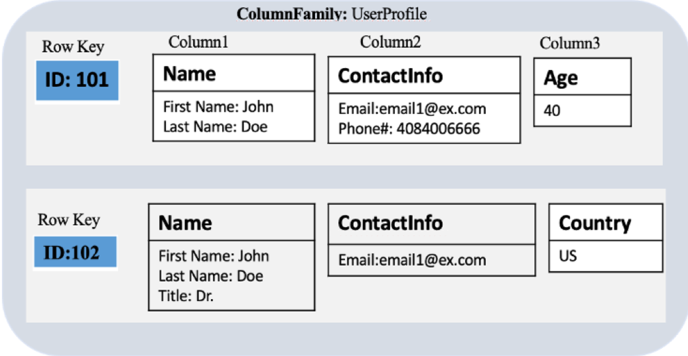
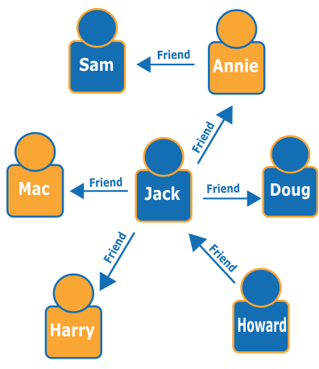
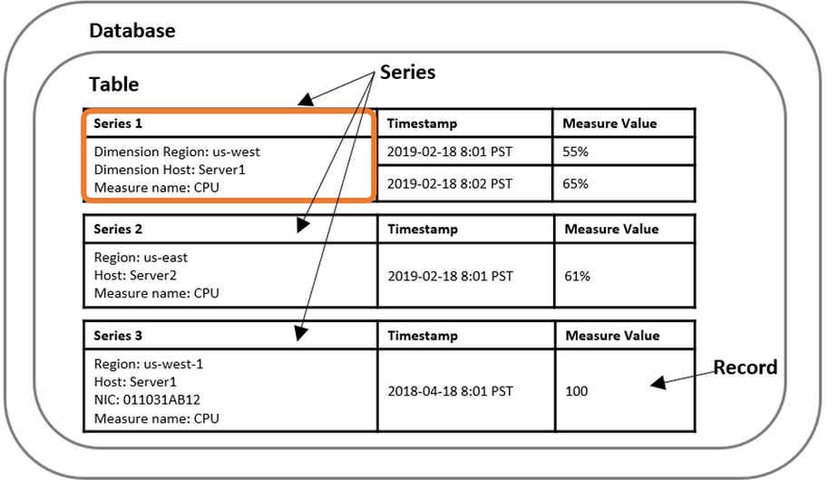
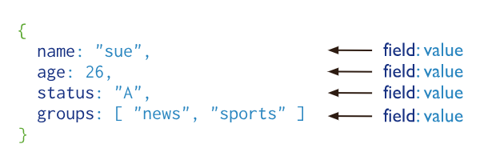

What is it?  
Compare SQL to NoSQL  
What language(s) can be used?  
Example NoSQL Schema design  
NoSQL is scalable. Explain the concept and some benefits of it and any negatives?  
Types of NoSQL Database (as many as you can find?
# NoSQL
### **What is NoSQL?**

When people use the term “NoSQL database”, they typically use it to refer to any non-relational database. Some say the term “NoSQL” stands for “non SQL” while others say it stands for “not only SQL.” Either way, most agree that NoSQL databases are databases that store data in a format other than relational tables.
Scalable and flexible

|               | SQL                                                                                                                                              | NO SQL                                                                                                                                           |
| ------------- | ------------------------------------------------------------------------------------------------------------------------------------------------ | ------------------------------------------------------------------------------------------------------------------------------------------------ |
| Database type | Relational Databases                                                                                                                             | Non-relational Databases / Distributed Databases                                                                                                 |
| Structure     | Table- based                                                                                                                                     | key-value pairs,  Document-Based, Graph databases,wide- column stores                                                                            |
| Scalability   | Designed for scaling up vertically by upgrading one expensive custom-built hardware                                                              | Designed for scaling out **horizontally** by using shards to distribute load across multiple commodity (inexpensive) hardware, more powerful     |
| Strength      | Great for highly structured data and don't anticipate changes to the database structure                                                          | Pairs well with fast paced, agile development teams. // Data consistency  (일관성)and integrity is not priority // Expecting high transaction load. |
| Pros          | - Easy to use and setup.  <br>- Universal, compatible with many tools.  <br>- Good at high-performance workloads.  <br>- Good at structure data. | - No investment to design model.  <br>- Rapid development cycles.  <br>- In general faster than SQL.  <br>- Runs well on the cloud.              |
| Cons          | - Time consuming to understand and design the structure of the database.  <br>- Can be difficult to scale.                                       | - Unsuited for interconnected data  <br>- Technology still maturing.  <br>- Can have slower response time.                                       |

### **Language**
SQL databases use SQL (Structured Query Language). NoSQL databases use JSON (JavaScript Object Notation), XML, YAML, or binary schema, facilitating unstructured data.

### **Example NoSQL Schema design**


#### Design Explanation:
The address has been moved as an array is flexible enough to accommodate additional entries in the future.
Each item in the address array has a limited number of fields, no need to create a separate collection.



#### Design Explanation:
1-M relationships are advised to handle in a single model where data size does not increase drastically. Therefore region, country, and state are handled in a single document which is kind of a defined set of data.
Cities are kept in a separate collection for 2 reasons:
For some countries, The number of cities is huge and this will make document size much bigger.
To avoid region unnecessary nested and complex modeling.

Schema - A vs B — Better Query Performance:
The city collection provides wider range of options to query data from region collection efficiently and faster, based on “region_id”, “country_id” and “state_id”.
Cities can be grouped easily based on “region_id”, “country_id” or “state_id” more efficiently.


#### Design Explanation:
This schema has less nested objects therefor more clarity
It is much easier for applications such as NodeJS apps to handle queries based on predefined schemas.
Schema — A vs B — Better Query Performance:
B does contain redundancy but in NoSQL, performance is preferred to normalization.
The data in the above example is relatively limited, but consider a business case where millions of documents are involved, the performance of Schema-A is no match for Schema-B throughput.

### Types of NoSQL
NoSQL databases come in several types, each designed to handle specific data storage and retrieval requirements. Here are the primary types of NoSQL databases along with examples:

1. ```Document Stores```
Description: Store and manage data as documents, typically in JSON, BSON, or XML format. They are suitable for semi-structured data and provide flexibility in data modelling.
Examples: MongoDB, CouchDB, RavenDB.


2. ```Key-Value Stores```
Description: Store data as key-value pairs, where each key is unique and maps to a value. They are highly performant for simple get and put operations.
Examples: Redis, Amazon DynamoDB, Riak, Aerospike


3. ```Column-Family Stores (Wide-Column Stores)```
Description: Store data in columns rather than rows, allowing for efficient storage and retrieval of large datasets. They are ideal for analytical applications.
Examples: Apache Cassandra, HBase, ScyllaDB, Google Bigtable

 
4. ```Graph Databases```
Description: Designed to store and navigate relationships between data points, represented as nodes and edges. They are excellent for use cases involving complex relationships.
Examples: Neo4j, Amazon Neptune, ArangoDB, OrientDB

5. ```Time-Series Databases```
Description: Optimised for storing and querying time-stamped or time-series data, making them suitable for applications like IoT, monitoring, and analytics.
Examples: InfluxDB, TimescaleDB, OpenTSDB, Prometheus


6. ```Object-Oriented Databases```
Description: Store data in the form of objects, as used in object-oriented programming. They provide seamless integration with object-oriented languages.
Examples: db4o, ObjectDB, InterSystems Caché
7. ```Multimodel Databases```
Description: Support multiple data models (e.g., document, graph, key-value) within a single database engine, providing flexibility for diverse use cases.
Examples: ArangoDB, OrientDB, MarkLogic
8. ```Search Engines```
Description: Optimised for search operations, providing full-text search capabilities along with advanced querying.
Examples: Elasticsearch, Apache Solr, Splunk
9. ```Tuple Store```
Description: Store data as tuples, which are ordered lists of elements. They are similar to key-value stores but allow more complex data structures.
Examples: Amazon SimpleDB, FoundationDB
10. ```Ledger Databases```
Description: Specialised for recording transactions and maintaining a secure, immutable ledger of data changes.
Examples: Amazon QLDB (Quantum Ledger Database), Hyperledger Fabric
11. ```Spatial Databases```
Description: Designed to store and query spatial or geographic data, supporting spatial indexing and queries.
Examples: PostGIS (extension for PostgreSQL), MongoDB with GeoJSON, Neo4j with spatial plugins
12. ```NewSQL Databases```
Description: Combine the ACID guarantees of traditional SQL databases with the scalability of NoSQL databases.
Examples: Google Spanner, CockroachDB, VoltDB
Each type of NoSQL database is optimised for specific types of workloads and data models, providing flexibility and performance benefits for various applications. Selecting the appropriate NoSQL database depends on the specific requirements of the application, including data structure, query complexity, scalability needs, and consistency requirements.


# MongoDB

#### What is MongoDB?
No SQL database. Application. 
MongoDB is a document-oriented NoSQL database used for high volume data storage.
MongoDB stores data in flexible, JSON-like documents, meaning fields can vary from document to document and data structure can be changed over time
Each database contains collections which in turn contains documents. Each document can be different with a varying number of fields. The size and content of each document can be different from each other.

#### What are collections in Mongo? 
MongoDB stores documents in collections. Collections are analogous to tables in relational databases.

1. You can create a collection using the `createCollection()` database method.
```
db.createCollection("posts")
```
2. You can also create a collection during the insert process.
```commandline
We are here assuming object is a valid JavaScript object containing post data:

db.posts.insertOne(object)
db.collection.createIndex(keys, options, commitQuorum)
```


#### What are Documents?
MongoDB stores data records as BSON documents. BSON is a binary representation of JSON documents, though it contains more data types than JSON. For the BSON spec, see bsonspec.org. See also BSON Types.


##### Definition of Documents:
`JSON Format`: MongoDB documents are stored in a JSON-like format, specifically BSON (Binary JSON). JSON is a text-based format that is easy for humans to read and write and easy for machines to parse and generate.

`BSON Format`: While JSON is used for interaction, MongoDB actually stores data in BSON, a binary representation of JSON. BSON supports more data types and is more efficient in terms of storage and speed.

##### Structure of Documents
MongoDB documents consist of the following:

`Key-Value Pairs`: Documents are composed of multiple key-value pairs. Each key is a string, and each value can be of various types such as strings, numbers, arrays, or even other documents.

`Flexible Schema`: MongoDB is schemaless, meaning documents in a collection do not need to have the same set of fields or structure. This provides high flexibility in data modeling.


#### MongoDB Architecture, how does it work? 

**1. Documents:**
The fundamental unit of data in MongoDB, stored in BSON (Binary JSON) format.
Each document contains key-value pairs and can have a flexible schema.

**2. Collections:**
Groups of documents, analogous to tables in relational databases.
Collections do not enforce a schema, allowing for flexible document structures.

**3. Databases:**
Logical containers for collections.
A single MongoDB server can host multiple databases.

#### What are replica sets?
##### Replica Sets: 
A replica set in MongoDB is a group of mongod processes that maintain the same data set. Replica sets provide redundancy and high availability.

`Primary Node`: Accepts write operations.

`Secondary Nodes`: Replicate the primary’s data set and can serve read operations (depending on read preference settings).

`Arbiter`: A node that participates in elections for primary but does not hold data, used to break ties in elections.

##### What is sharding?
Sharding is the process of distributing data across multiple servers.

**Sharded Cluster Components**

`Shard`: Each shard contains a subset of the sharded data. Shards can be replica sets to provide redundancy and high availability.

`Mongos`: A routing service for MongoDB sharded clusters. It directs queries from applications to the appropriate shard(s).

`Config Servers`: Store metadata and configuration settings for the cluster. These servers manage the cluster’s metadata.

#### Advantages of MongoDB?

MongoDB offers several advantages that make it a popular choice for many developers and organizations. Here are some key benefits:

`1. Flexible Schema Design`

**Schema-less Structure:** MongoDB's document-oriented storage allows for a flexible schema design. This means you can store documents with varying structures in the same collection, making it easy to adapt to changing data requirements without costly migrations.
**Dynamic Schema:** You can add, delete, or update fields within documents without affecting other documents in the collection.

`2. Scalability`

**Horizontal Scalability:** MongoDB supports sharding, which allows the database to scale out by distributing data across multiple servers. This horizontal scalability enables handling large volumes of data and high throughput.
**Elasticity:** Easily add or remove nodes in a sharded cluster to manage load and storage capacity dynamically.
`3. High Performance`

**Efficient Storage:** BSON format allows for efficient storage and retrieval of data.
**Indexing:** MongoDB supports a variety of indexes (single field, compound, geospatial, text, etc.), which can significantly improve query performance.
**Aggregation Framework:** Provides powerful data processing capabilities directly within the database, reducing the need to transfer large datasets to the application layer for analysis.

`4. High Availability and Reliability`

**Replication:** Replica sets ensure data redundancy and high availability. If the primary node fails, an automatic failover process elects a new primary from the secondary nodes.
Automated Failover: Increases resilience and ensures minimal downtime, which is critical for production environments.

`5. Rich Query Language`

**Ad-hoc Queries:** Supports dynamic queries that can be constructed at runtime.
Expressive and Powerful: The MongoDB query language supports a wide range of operations, including filtering, sorting, projection, and aggregation.

#### Disadvantages of MongoDB?
`1. Limited Support for ACID Transactions`

**ACID Transactions:** MongoDB originally had limited support for ACID (Atomicity, Consistency, Isolation, Durability) transactions, especially for multi-document operations. Although transactions support has improved significantly since version 4.0, it still may not be as mature or as robust as in some traditional relational databases for certain use cases.

`2. Complexity in Managing Relationships`

**Lack of Joins:** Unlike relational databases, MongoDB does not support joins in the same way. While it provides mechanisms like embedded documents and the $lookup operator for simple joins, managing complex relationships and ensuring data integrity can be more challenging.

**Data Duplication:** To overcome the lack of joins, data often needs to be duplicated, which can lead to inconsistencies and increased storage requirements.

`3. Memory Usage`
High Memory Usage: MongoDB tends to use a significant amount of RAM to improve performance. It maintains indexes and frequently accessed data in memory, which can be costly for applications with large datasets.
Memory Mapped Storage: MongoDB uses memory-mapped files for data storage, which can lead to issues if the working set size exceeds the available RAM.

What scenarios is MongoDB good for?
What scenarios is it not good for?
 
