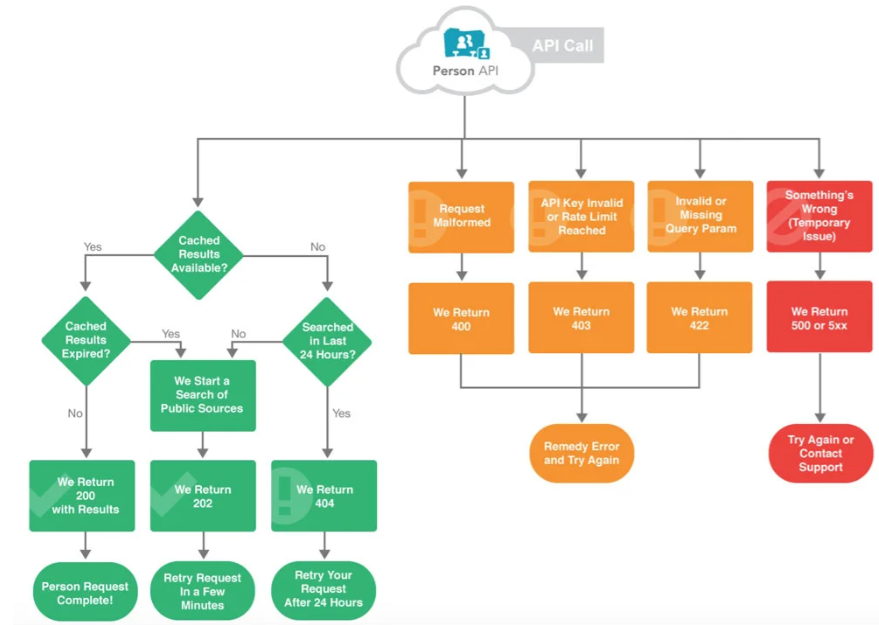

# JSON

### what does it stand for?
-   JSON stands for JavaScript Object Notation
-   JSON is a lightweight format for storing and transporting data
-   JSON is often used when data is sent from a server to a web page
-   JSON is "self-describing" and easy to understand

### What is it used for?

-   Transmitting data between a client and a server in web applications
-   Storing structured data in configuration files
- Logging data
- Data storage in various applications and programming languages

### What is it written in?
- JSON arrays are written inside square brackets. 
Just like in JavaScript, an array can contain objects:

```
"employees":[
    {"firstName":"John", "lastName":"Doe"},
    {"firstName":"Anna", "lastName":"Smith"},
    {"firstName":"Peter", "lastName":"Jones"}
]
```
### What data types can it store/use?
- Strings
- Numbers (integers and floats)
- Booleans (true or false)
- Arrays (ordered lists of values)
- Objects (unordered collections of key-value pairs)
- null (represents an empty value or absence of value)

```commandline
'{"name":"John", "age":30, "car":null}'

Strings
- {"name":"John"}

Numbers
- {"age":30}

Objects
- {"employee":{"name":"John", "age":30, "city":"New York"}}

Arrays
- {"employees":["John", "Anna", "Peter"]}

null
- {"middlename":null}
```

It defines an object with 3 properties:
- name
- age
- car
- Each property has a value.

If you parse the JSON string with a JavaScript program, you can access the data as an object:
```
let personName = obj.name;
let personAge = obj.age;
```

JSON values cannot be one of the following data types:
- a function
- a date
- undefined

### What is the JSON syntax for:
JSON syntax is derived from JavaScript object notation syntax:

- Data is in name/value pairs
- Data is separated by commas
- Curly braces hold objects
- Square brackets hold arrays

JSON Data - A Name and a Value - JSON names require double quotes.
`"name":"John"`

The JSON format is almost identical to JavaScript objects.
In JSON, keys must be strings, written with double quotes:

```
JSON
{"name":"John"}
```

Objects
- Because JSON syntax is derived from JavaScript object notation, very little extra software is needed to work with JSON within JavaScript.
- With JavaScript you can create an object and assign data to it, like this:
```
person = {name:"John", age:31, city:"New York"};

person["name"]  # returns John
person["name"] = "Gilbert"  # modified  person name to Gilbert
```


## API

#### What are APIs?
- API stands for Application Programming Interface.
- A Web API is an application programming interface for the Web.
- A Browser API can extend the functionality of a web browser.
- A Server API can extend the functionality of a web server.

#### How are APIs used and why are they popular?
- APIs are `used` to integrate new applications with existing software systems. This increases development speed because each functionality doesn't have to be written from scratch. You can use APIs to leverage existing code.
- APIs are quite `popular` these days as they allow different applications to communicate with each other in real-time, on the internet. APIs have made it possible for different applications of different origins to interact with each other

#### Find a diagram that showcases the API data transfer process. Add it to your README
- An API diagram documents the routines and protocols of an API to clarify its structure and behavior. API diagrams are helpful because they quickly show both developers and non-technical stakeholders like product managers understand how the system will behave.


#### what are REST APIS? what makes an API RESTful?
- A REST API (also called a RESTful API or RESTful web API) is an application programming interface (API) that conforms to the design principles of the representational state transfer (REST) architectural style. REST APIs provide a flexible, lightweight way to integrate applications and to connect components in microservices architectures.
- `REST` stands for Representational State Transfer
- `REST` APIs are a set of architectural principles for creating web services
- They use standard HTTP methods such as GET, POST, PUT, DELETE for CRUD operations
- `REST APIs` are stateless, meaning each request from a client contains all the information necessary to process the request
- They utilize URIs (Uniform Resource Identifiers) to identify resources
- `RESTful APIs` often use JSON or XML for data exchange formats
- They emphasize scalability, reliability, and performance
- `RESTful` APIs follow a client-server architecture, where the client and server are separate concerns
- They support caching to improve performance
- `REST API`s should be self-descriptive, meaning clients can understand how to interact with them through hypermedia links or documentation

## What is HTTP?
- HTTP stands for Hyper Text Transfer Protocol
- WWW is about communication between web clients and servers
- Communication between client computers and web servers is done by sending HTTP Requests and receiving HTTP Responses

#### find diagrams that showcase:


#### HTTP Request / Response
Communication between clients and servers is done by requests and responses:

- A client (a browser) sends an HTTP request to the web
- A web server receives the request
- The server runs an application to process the request
- The server returns an HTTP response (output) to the browser
- The client (the browser) receives the response

#### What are the 5 HTTP verbs?

`GET`
The GET method requests a representation of the specified resource. Requests using GET should only retrieve data.

`HEAD`
The HEAD method asks for a response identical to a GET request, but without the response body.

`POST`
The POST method submits an entity to the specified resource, often causing a change in state or side effects on the server.

`PUT`
The PUT method replaces all current representations of the target resource with the request payload.

`DELETE`
The DELETE method deletes the specified resource.


