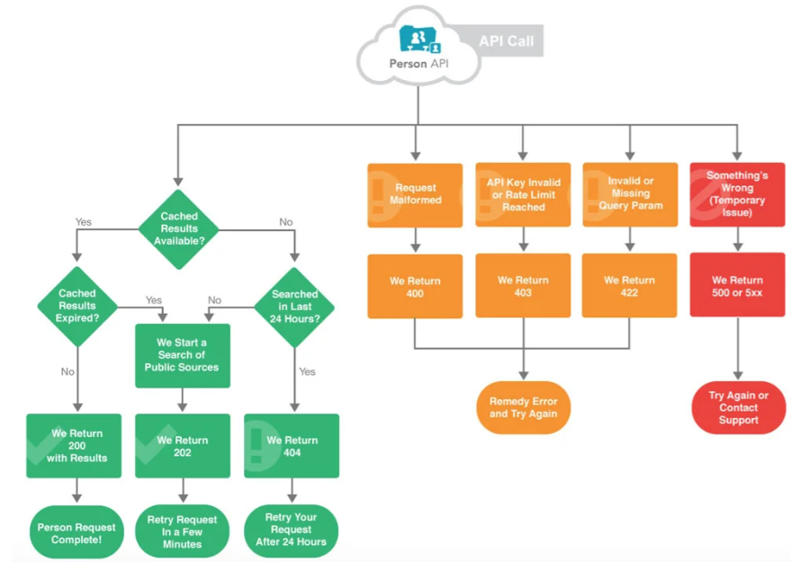

## API

#### What are APIs?
- API stands for Application Programming Interface.
- A Web API is an application programming interface for the Web.
- A Browser API can extend the functionality of a web browser.
- A Server API can extend the functionality of a web server.

#### How are APIs used and why are they popular?
- APIs are `used` to integrate new applications with existing software systems. This increases development speed because each functionality doesn't have to be written from scratch. You can use APIs to leverage existing code.
- APIs are quite `popular` these days as they allow different applications to communicate with each other in real-time, on the internet. APIs have made it possible for different applications of different origins to interact with each other

#### Find a diagram that showcases the API data transfer process. Add it to your README
- An API diagram documents the routines and protocols of an API to clarify its structure and behavior. API diagrams are helpful because they quickly show both developers and non-technical stakeholders like product managers understand how the system will behave.

#### what are REST APIS? what makes an API RESTful?
- A REST API (also called a RESTful API or RESTful web API) is an application programming interface (API) that conforms to the design principles of the representational state transfer (REST) architectural style. REST APIs provide a flexible, lightweight way to integrate applications and to connect components in microservices architectures.
- `REST` stands for Representational State Transfer
- `REST` APIs are a set of architectural principles for creating web services
- They use standard HTTP methods such as GET, POST, PUT, DELETE for CRUD operations
- `REST APIs` are stateless, meaning each request from a client contains all the information necessary to process the request
- They utilize URIs (Uniform Resource Identifiers) to identify resources
- `RESTful APIs` often use JSON or XML for data exchange formats
- They emphasize scalability, reliability, and performance
- `RESTful` APIs follow a client-server architecture, where the client and server are separate concerns
- They support caching to improve performance
- `REST API`s should be self-descriptive, meaning clients can understand how to interact with them through hypermedia links or documentation

## What is HTTP?
- HTTP stands for Hyper Text Transfer Protocol
- WWW is about communication between web clients and servers
- Communication between client computers and web servers is done by sending HTTP Requests and receiving HTTP Responses

#### find diagrams that showcase:
-   HTTP request structure
- HTTP Response Structure
add them to your README
- 
What are the 5 HTTP verbs?
